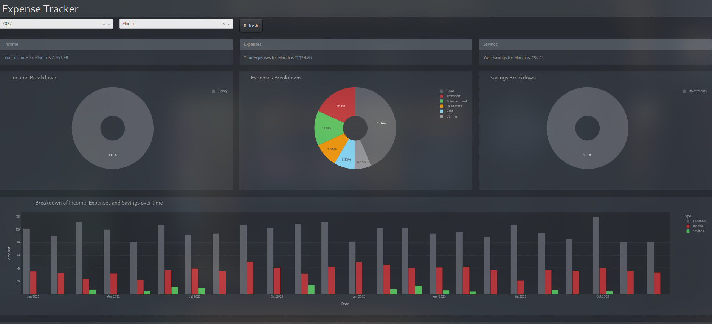
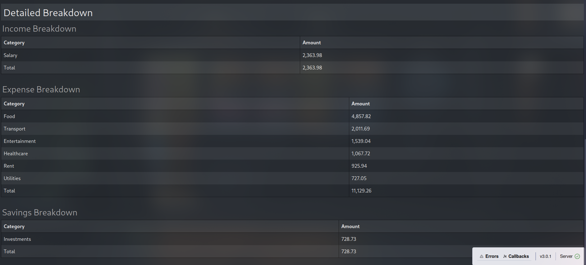

# Personal Finance Dashboard

A dynamic web-based dashboard built with Python and Dash to help you track and visualize your personal finances.

## Screenshots




## Features

- Interactive visualization of income, expenses, and savings
- Monthly and yearly filtering options
- Detailed breakdown of financial categories
- Pie charts showing distribution of finances
- Time series analysis of financial trends
- Responsive tables with detailed breakdowns
- Dark theme interface for better visibility

## Tech Stack

- Python 3.x
- Dash
- Plotly
- Pandas
- Dash Bootstrap Components
- NumPy

## Installation

1. Clone the repository:
```bash
git clone https://github.com/Ratludu/Personal-Finance-Dashboard
cd Personal-Finance-Dashboard
```

2. Install required packages:
```bash
pip install -r requirements.txt
```

3. Run the application:
```bash
python app.py
```

## Usage

The dashboard consists of several components:

1. **Filters**
   - Year dropdown
   - Month dropdown
   - Refresh button

2. **Summary Cards**
   - Income overview
   - Expenses overview
   - Savings overview

3. **Visualizations**
   - Pie charts for Income, Expenses, and Savings distribution
   - Time series chart showing trends over time

4. **Detailed Tables**
   - Comprehensive breakdown of all financial categories

## Data Structure

The dashboard expects financial data with the following columns:
- Type (Income/Expenses/Savings)
- Category
- Amount
- Date
- Details

## Contributing

Feel free to fork this project and submit pull requests. For major changes, please open an issue first to discuss what you would like to change.

## License

[MIT](https://choosealicense.com/licenses/mit/)
